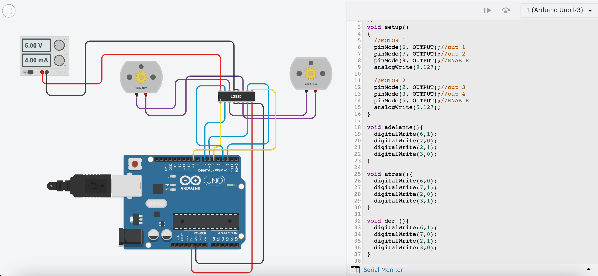

# Sesión 1 — Como documente mi portafolio web

## Qué debía lograr hoy

- [✅] Aprender a utilizar los comandos de Markdown
- [✅] Aprender a utilizar los comandos de Git

## Qué usé

- Virtual Studio Code
- Git code
- Markdown

## Qué hice y qué pasó (evidencia)

Realizamos una pequeña introducción de nuestra persona para practicar los diferentes tipos de comandos de VSC

>Hola, me llamo Maria Fernanda Muñoz Muñiz, y estoy cursando la carrera de Ingenieria Mecatronica debido a que me interesa mucho todo el area de programación y creación de maquinaria o robots para facilitar la vida diaria


>Vengo de Villahermosa,Tabasco, tengo 19 años y actualmente soy foranea estudiando en la Universidad Iberoamericana en Puebla


>Tengo muchos intereses como tocar la bateria, hacer crochet, jugar volleyball y salir con amigos


>Tengo 2 hermanos y una chihuahua, mi hermano mayor esta viviendo en puebla estudiando la universidad y el menor sigue en la prepa


utilizamos estos comandos de Markdown:
```bash

# Título H1
## Título h2
> citas
--- (separador horizontal)
- listas

```

Despues utilizamos los comandos de git para guardar y subir nuestro proceso a la pagina:

```bash
 git pull
 git add .
 git commit -m ""
 git push
 git status
 ```

## Qué falló y cómo lo resolví
Me sorprendio la facilidad de su uso y la variedad de comandos diferentes que tiene esta plataforma

## Qué aprendí
Aprendi a usar Virtual Studio Code el cual pense que era una herramienta más compleja de lo que en realidad es, se me facilito familiarizarme con sus comandos y uso, y ya tengo una idea clara de las entregas que voy a realizar durante todo este parcial y de como tienen que hacerse

## Siguiente paso
Aprendí a utilizar esta herramienta, la cual me será de gran ayuda para poder documentar todos mis trabajos de una manera más organizada. Además, considero que es una herramienta muy útil porque se adapta a las necesidades de lo que estoy estudiando y me permite presentar la información de una forma más clara y estructurada.