# Como utilize un arduino

## Qué debía lograr hoy   

- [✅] Configurar el entorno de desarrollo del ESP32
- [✅] Controlar entradas y salidas digitales (LED, botón con pull-up y antirrebote)
- [✅] Establecer comunicación Bluetooth con un protocolo de comandos — la base del cerebro y el control remoto de tu carro.

## Qué usé

**Materiales**

- Tarjeta: ESP32 DevKit V1 (WROOM-32). Importante: debe ser ESP32 “clásico”; las variantes S3/C3 no tienen Bluetooth Classic y los ejemplos de BluetoothSerial no compilan en ellas.
- Cable: USB de datos.
- Breadboard: + jumpers.
- LED: 1 + 1 resistor 220 Ω.
- Botón: 1 (push button).
- Resistor: (Opcional) 1 10 kΩ si no usamos pull-up interno.

**Software:**

- Arduino IDE + Paquete de tarjetas ESP32.
- (Opcional) VS Code + Extensión Arduino.

## Qué hice y qué pasó (evidencia)
*2–4 fotos o capturas TUYAS, cada una con un pie de foto de una línea diciendo qué muestra.
Si mediste algo, va la tabla — la tabla ES la evidencia.*
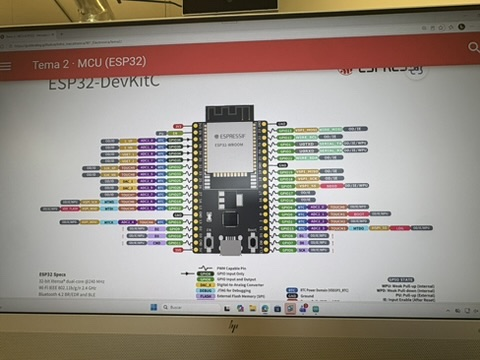

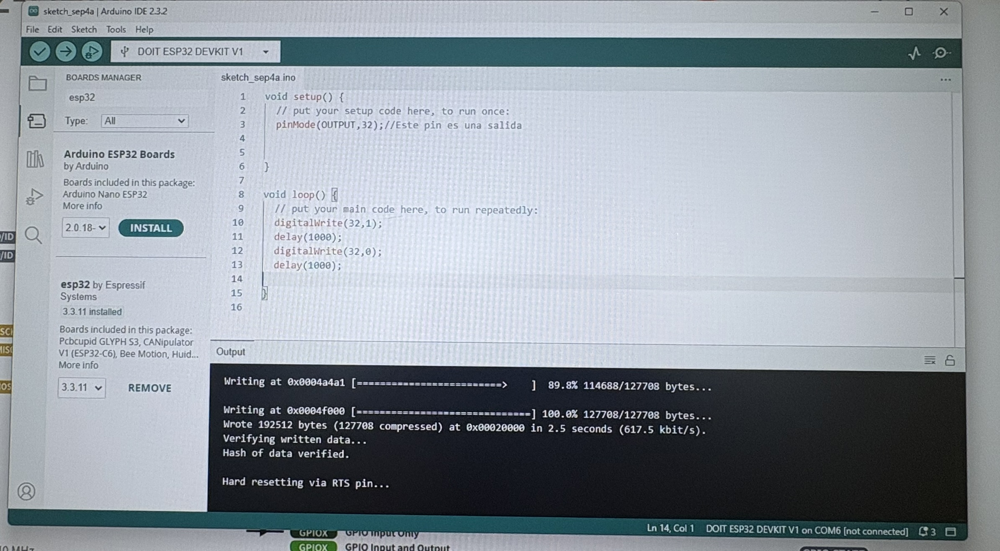

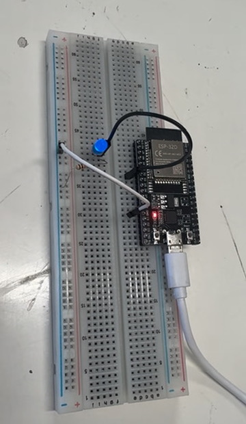

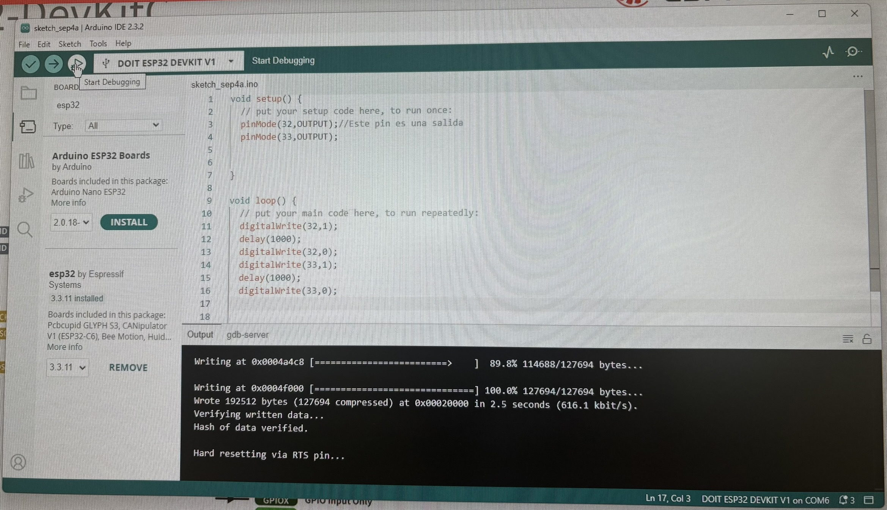

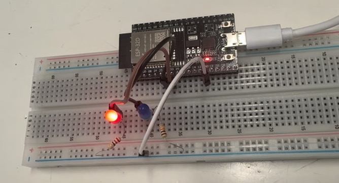
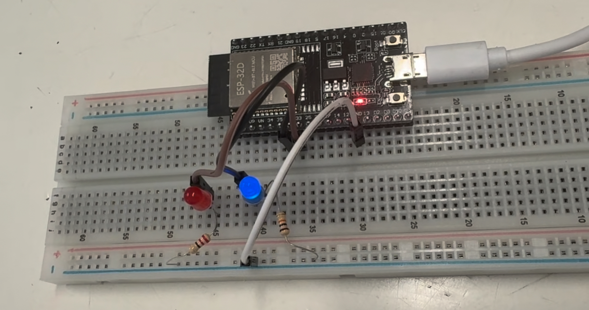

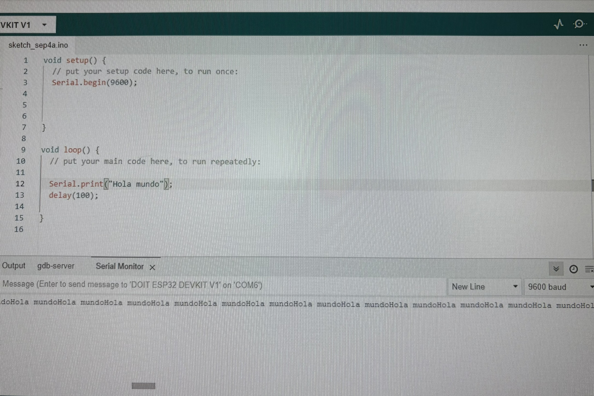
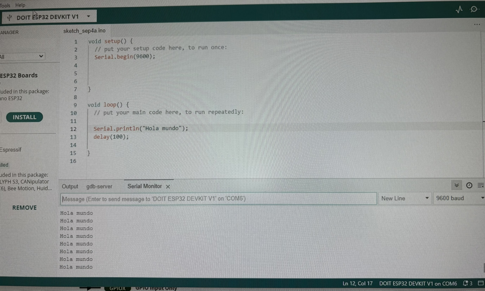

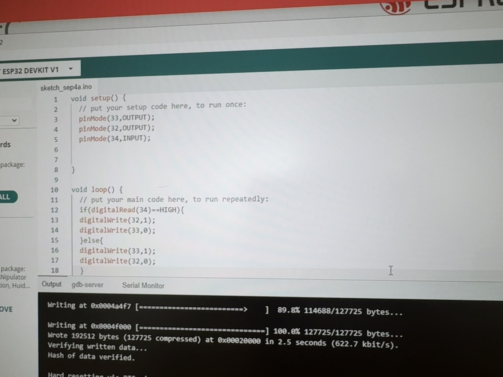

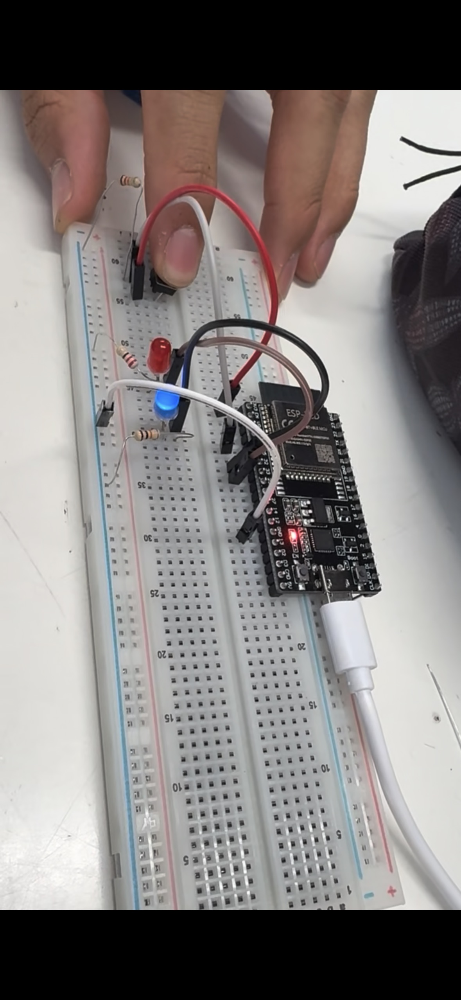
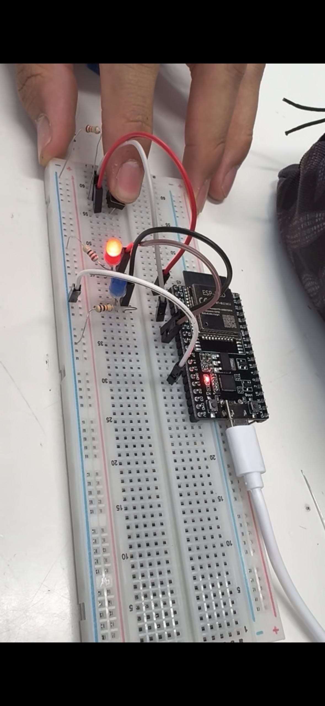

| Magnitud | Teórico | Medido | % error |
| --- | --- | --- | --- |
|  |  |  |  |

## Qué falló y cómo lo resolví
*Mínimo una. Si de verdad nada falló, escribe qué te sorprendió.
Formato: síntoma → cómo lo encontré → solución.*

•⁠  ⁠*Síntoma:* ...
•⁠  ⁠*Cómo lo encontré:* ...
•⁠  ⁠*Solución:* ...

## Qué aprendí
3 a 5 líneas, con tus palabras. No es resumen del tema: es qué entendiste TÚ que antes no.

## Siguiente paso
Una línea: qué sigue antes de la próxima sesión.

El la clase del dia viernes 4 de septiembre realizamos una practica sobre las tablas de arduino

