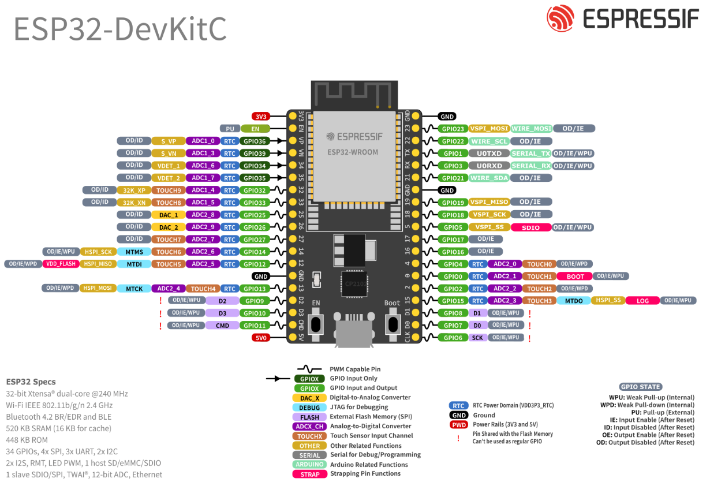

# Sesión 3 - Como utilize un arduino

## Qué debía lograr hoy   

- [✅] Configurar el entorno de desarrollo del ESP32
- [✅] Controlar entradas y salidas digitales (LED, botón con pull-up y antirrebote)
- [✅] Establecer comunicación Bluetooth con un protocolo de comandos — la base del cerebro y el control remoto de tu carro.


## Qué usé

**Materiales**

- Tarjeta: ESP32 DevKit V1 (WROOM-32). Importante: debe ser ESP32 “clásico”; las variantes S3/C3 no tienen Bluetooth Classic y los ejemplos de BluetoothSerial no compilan en ellas.
- Cable: USB de datos.
- Breadboard: + jumpers.
- LED: 1 + 1 resistor 220 Ω.
- Botón: 1 (push button).
- Resistor: (Opcional) 1 10 kΩ si no usamos pull-up interno.

**Software:**

- Arduino IDE + Paquete de tarjetas ESP32.
- (Opcional) VS Code + Extensión Arduino.

## Qué hice y qué pasó (evidencia)


primero analizamos las entradas,salidas, la tierra y la salida de voltaje del arduino

Despues generamos diferentes codigos:

En este generamos que el led se parpadeara cada segundo 

```sketch
void setup() {
    pinMode(OUTPUT,32);
}

void loop() {
    digitalWrite(32,1);
    delay(1000);
    digitalWrite(32,0);
    delay(1000);
}
```


En este generamos que un led azul y y rojo intercalaran cada segundo, entonces se prendia uno y el otro se apagaba


```sketch
void setup() {
    pinMode(32,OUTPUT);
    pinMode(33,OUTPUT);
}

void loop() {
    digitalWrite(32,1);
    delay(1000);
    digitalWrite(32,0);
    digitalWrite(33,1);
    delay(1000);
    digitalWrite(33,0);
}
```


despues utilisamos el comando serial.print y serial.println, los cuales imprimian hola mundo, solo que uno lo hacia en fila y el otro en columna

```sketch
void setup() {
    Serial.begin(9600);
}

void loop() {
    Serial.print("Hola mundo");
    delay(100);
   
}
```
>Hola mundo Hola mundo Hola mundo Hola mundo

```sketch
void setup() {
    Serial.begin(9600);
}

void loop() {
    Serial.println("Hola mundo");
    delay(100);
   
}
```
>Hola mundo

>Hola mundo

>Hola mundo

>Hola mundo

Despues generamos uno donde agregamos un boton, al momento de presionarlo el LED azul prendia y el rojo se apagaba, y cuando el boton esta libre el LED rojo prendia y el azul se apagaba

```sketch
void setup() {
    pinMode(32,OUTPUT);
    pinMode(33,OUTPUT);
    pinMode(34,INPUT);
}

void loop() {
    if(digitalRead(34)==HIGH);
    digitalWrite(32,1);
    digitalWrite(33,0);
}else{
    digitalWrite(33,1);
    digitalWrite(32,0);
}
```


El ultimo que hicimos genero que, mediante una apllicación, escribiendo ON y OFF pudieramos prender y apagar un LED
```sketch
#include "BluetoothSerial.h"
void setup() {
    DameDeBaja.begin("Oliver dame de baja")
    DameDeBaja.setTimeout(20);
    Serial.begin(9600);
    pinMode(32,INPUT);
}


void loop() {
    if(DameDeBaja.available()){
        String mesaje = DameDeBaja.readStringUntil('\n');
        mensaje.trim();
        if(mensaje == "ON"){
        digitalWrite(32,1);
    }
     if(mensaje == "OFF");{
       digitalWrite(32,0);}
}
}
```

## Qué falló y cómo lo resolví

-  ⁠*Síntoma:* El circuito fallaba y funcionada de manera diferente a la manera que se supone debia funcionar 
-  ⁠*Cómo lo encontré:* Al ver que el LED y el boton fucionaban de manera erronea revisamos cada conección del ESP32 y encontramos que en ciertas conecciones no generaba ninguna reacción
-  ⁠*Solución:* Cambiamos la conección de INPUT de un led y de esa manera se genero la reacción esperada de la programación

## Qué aprendí
Aprendí lo que era la tabla ESP32, su funcionamiento, como los INPUTs y OUTPUTs, tambien a programar desde la computadora para encender lEDs o controlar lo que va a hacer un boton al precionarlo, me sorprendio la facilidad de generar este tipo de programación al momento de generar un funcionamiento con bluetooth ya que pensaba que generar que un led se pudiera prenderce y apagarse con bluetooth seria más complicado

## Siguiente paso
Mejorar el uso del bluetooth y adaptarlo al movimiento de un motor


