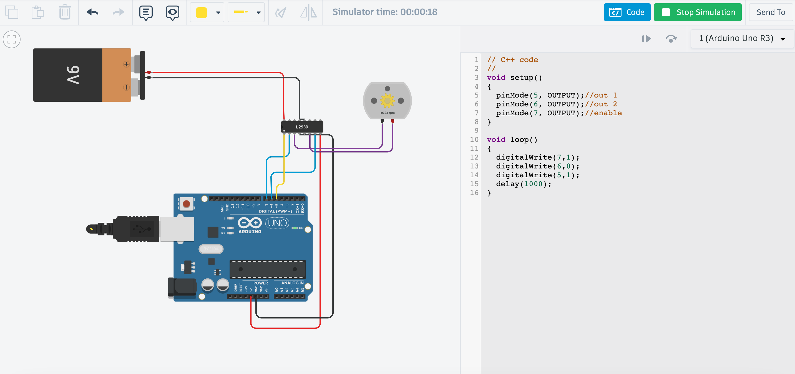
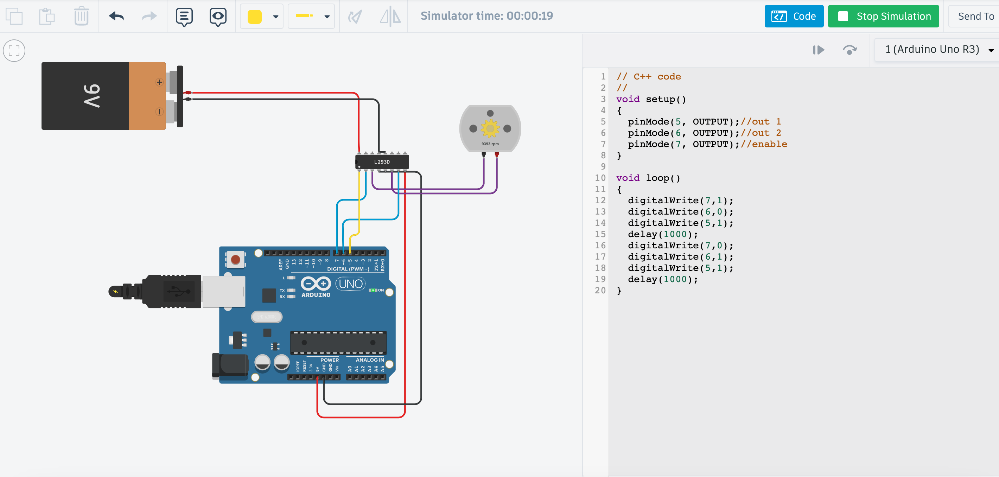
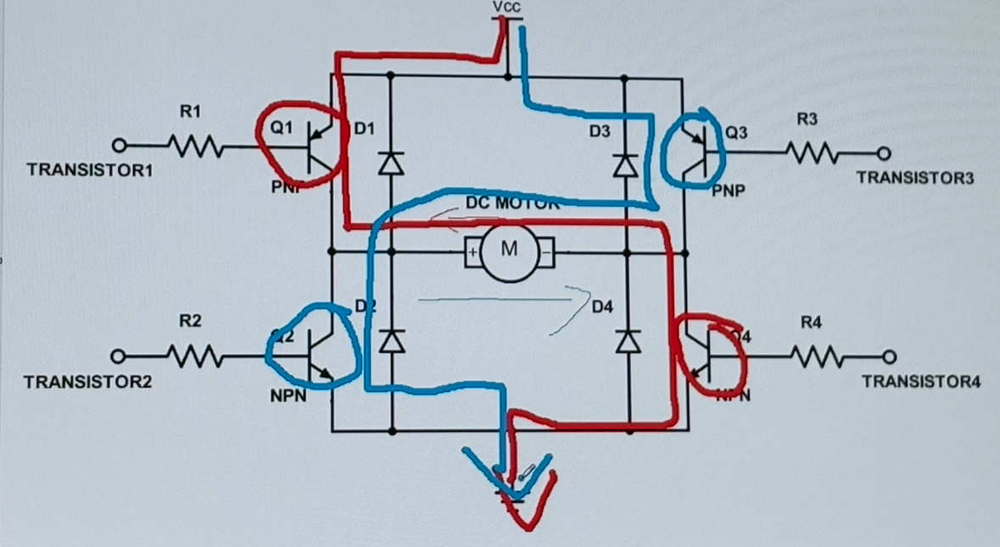
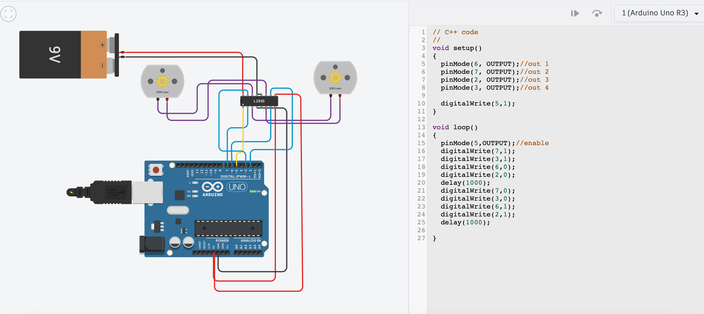
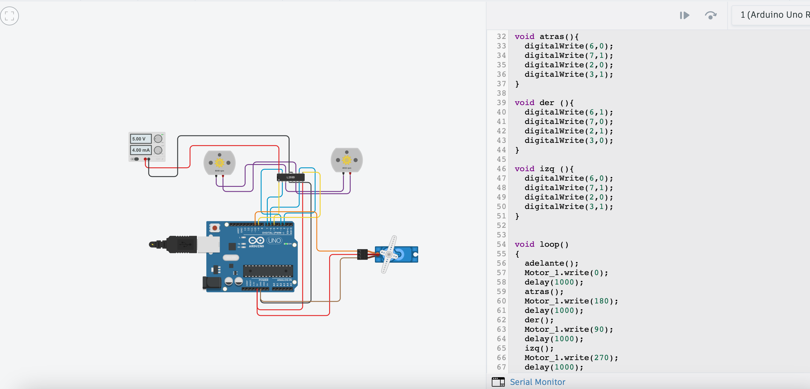

# Sesión 4 - Utilizando arduino UNO 

## Qué debía lograr hoy
  

- [✅]  Controlar un motor DC con puente H (sentido de giro y velocidad por PWM) y un servo
- [❌] Midiendo corriente y comportamiento bajo carga — los músculos de tu carro.

## Qué usé
- ESP32 DevKit V1 
- Protoboard
- Jumpers
- Driver TB6612 (puente H) 
- 1–2 motores DC TT con caja reductora.
- Servo SG90 (o similar)
- Potenciómetro de 10 kΩ.
- Fuente/batería para motores separada del ESP32 (con GND común)
- multímetro.


## Qué hice y qué pasó (evidencia)

Lo primero que hicimos fue hacer que un motor girara para despues hacer que este cambie de dirección en su rotación

```Cpp
void setup()
{
    pinMode(5,OUTPUT);
    pinMode(6,OUTPUT);
    pinMode(7,OUTPUT);
}

void loop()
{
    digitalWrite(7,1);
    digitalWrite(6,0);
    digitalWrite(5,1);
    delay(1000);
}
```



```Cpp
void setup()
{
    pinMode(5,OUTPUT);
    pinMode(6,OUTPUT);
    pinMode(7,OUTPUT);
}

void loop()
{
    digitalWrite(7,1);
    digitalWrite(6,0);
    digitalWrite(5,1);
    delay(1000);
    digitalWrite(7,0);
    digitalWrite(6,1);
    digitalWrite(5,1);
    delay(1000);
}
```


Despues para hacer que dos motores se movieran tomamos en cuenta el diagrama de puentes H


```Cpp
void setup()
{
    pinMode(6,OUTPUT);
    pinMode(7,OUTPUT);
    pinMode(2,OUTPUT);
    pinMode(3,OUTPUT);

    digitalWrite(5,1);
}

void loop()
{
    pinMode(5,OUTPUT);
    digitalWrite(7,1);
    digitalWrite(3,1);
    digitalWrite(6,0);
    digitalWrite(2,0);
    delay(1000);
    digitalWrite(7,0);
    digitalWrite(3,0);
    digitalWrite(6,1);
    digitalWrite(2,1);
    delay(1000);
}
```


Por ultimo generamos que los dos motores, más aparte el servo giraran de cierta forma organizada, haciendo que el motor se vaya a distintas direcciones en un patron
```Cpp
#include <Servo.h>

Servo Motor_1;

void setup()
{
  //SERVO
  Motor_1.attach(10);
  
  //MOTOR 1
  pinMode(6, OUTPUT);//out 1
  pinMode(7, OUTPUT);//out 2
  pinMode(9, OUTPUT);//ENABLE
  analogWrite(9,127);
  
  //MOTOR 2
  pinMode(2, OUTPUT);//out 3
  pinMode(3, OUTPUT);//out 4
  pinMode(5, OUTPUT);//ENABLE
  analogWrite(5,127);
}

void adelante(){
  digitalWrite(6,1);
  digitalWrite(7,0);
  digitalWrite(2,1);
  digitalWrite(3,0);
}

void atras(){
  digitalWrite(6,0);
  digitalWrite(7,1);
  digitalWrite(2,0);
  digitalWrite(3,1);
}

void der (){
  digitalWrite(6,1);
  digitalWrite(7,0);
  digitalWrite(2,1);
  digitalWrite(3,0);
}

void izq (){
  digitalWrite(6,0);
  digitalWrite(7,1);
  digitalWrite(2,0);
  digitalWrite(3,1);
}
  
  
void loop()
{
  adelante();
  Motor_1.write(0);
  delay(1000);
  atras();
  Motor_1.write(180);
  delay(1000);
  der();
  Motor_1.write(90);
  delay(1000);
  izq();
  Motor_1.write(270);
  delay(1000);
}
```



## Qué falló y cómo lo resolví

- **Síntoma:** Al momento de generar que dos motores intercalaran entre girar a la izquierda y derecha solo podia generar que se moviera uno
- **Cómo lo encontré:** Al momento de iniciar la simulación solo un motor se movia, mientras que el otro no hacia nada
- **Solución:** Me funciono cambiar el OUTPUT de uno de los motores, de esa manera ambos funcionaron correctamente

## Qué aprendí
Aprendi los nombres de los motores y de la excistencia del Servo, me parecio muy interesante como se genera que un motor gire de un lado al otro y el como para que este pueda hacer eso tiene que elevar sus niveles de energia para poder, primero que todo, detenerse y despues de eso girar a la misma velocidad pero en otra dirección, por eso mismo tambien me hize mas conciente de lo precabida que tengo que ser con la cantidad de energia que le doy a un motor, ya que si estoy al limite solo con que avanze, al momento de cambiar de dirección este se puede exceder y generar un fallo que dañe el motor.

## Siguiente paso
Utilizar estos materiales en fisico para comprobar que esta teoria estubo correcta.


