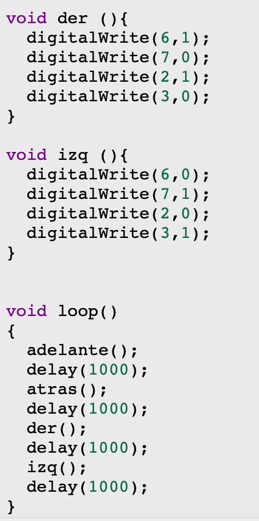

# Sesión 4 - Utilizando arduino UNO 

## Qué debía lograr hoy
  

- [✅]  Controlar un motor DC con puente H (sentido de giro y velocidad por PWM) y un servo
- [❌] Midiendo corriente y comportamiento bajo carga — los músculos de tu carro.

## Qué usé
- ESP32 DevKit V1 
- Protoboard
- Jumpers
- Driver TB6612 (puente H) 
- 1–2 motores DC TT con caja reductora.
- Servo SG90 (o similar)
- Potenciómetro de 10 kΩ.
- Fuente/batería para motores separada del ESP32 (con GND común)
- multímetro.

## Qué hice y qué pasó (evidencia)

## Qué falló y cómo lo resolví

- **Síntoma:** Al momento de generar que dos motores intercalaran entre girar a la izquierda y derecha solo podia generar que se moviera uno
- **Cómo lo encontré:** Al momento de iniciar la simulación solo un motor se movia, mientras que el otro no hacia nada
- **Solución:** Me funciono cambiar el OUTPUT de uno de los motores, de esa manera ambos funcionaron correctamente

## Qué aprendí
Aprendi los nombres de los motores y de la excistencia del Servo, me parecio muy interesante como se genera que un motor gire de un lado al otro y el como para que este pueda hacer eso tiene que elevar sus niveles de energia para poder, primero que todo, detenerse y despues de eso girar a la misma velocidad pero en otra dirección, por eso mismo tambien me hize mas conciente de lo precabida que tengo que ser con la cantidad de energia que le doy a un motor, ya que si estoy al limite solo con que avanze, al momento de cambiar de dirección este se puede exceder y generar un fallo que dañe el motor.

## Siguiente paso
Utilizar estos materiales en fisico para comprobar que esta teoria estubo correcta.

