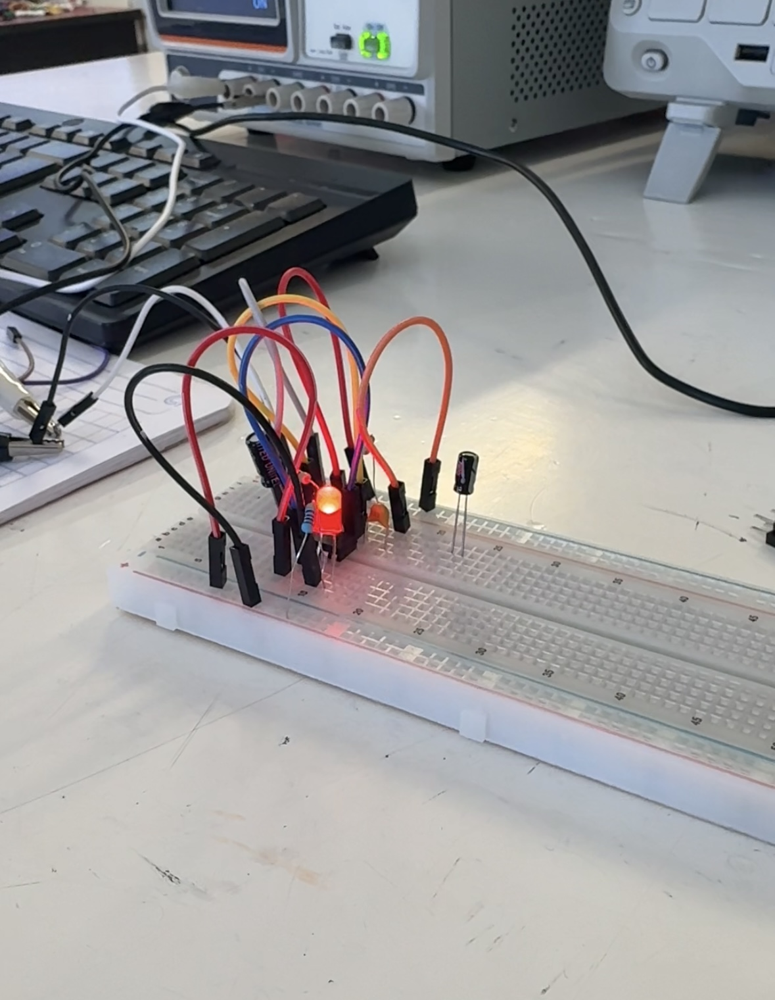
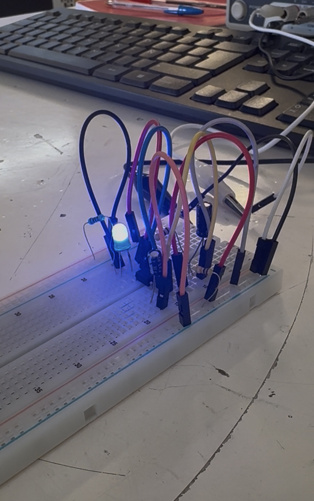
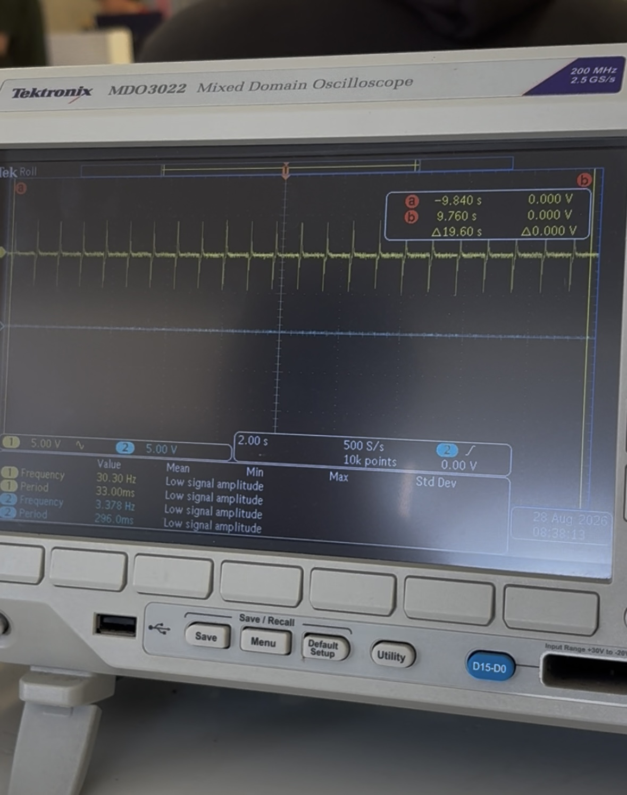
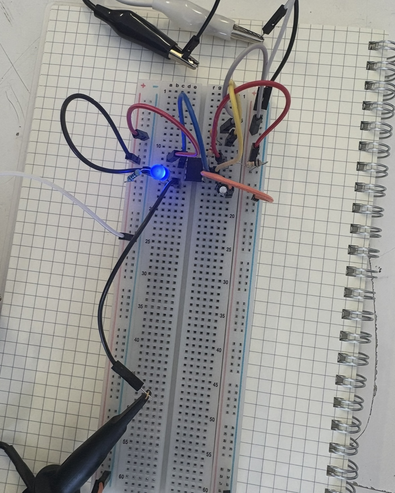
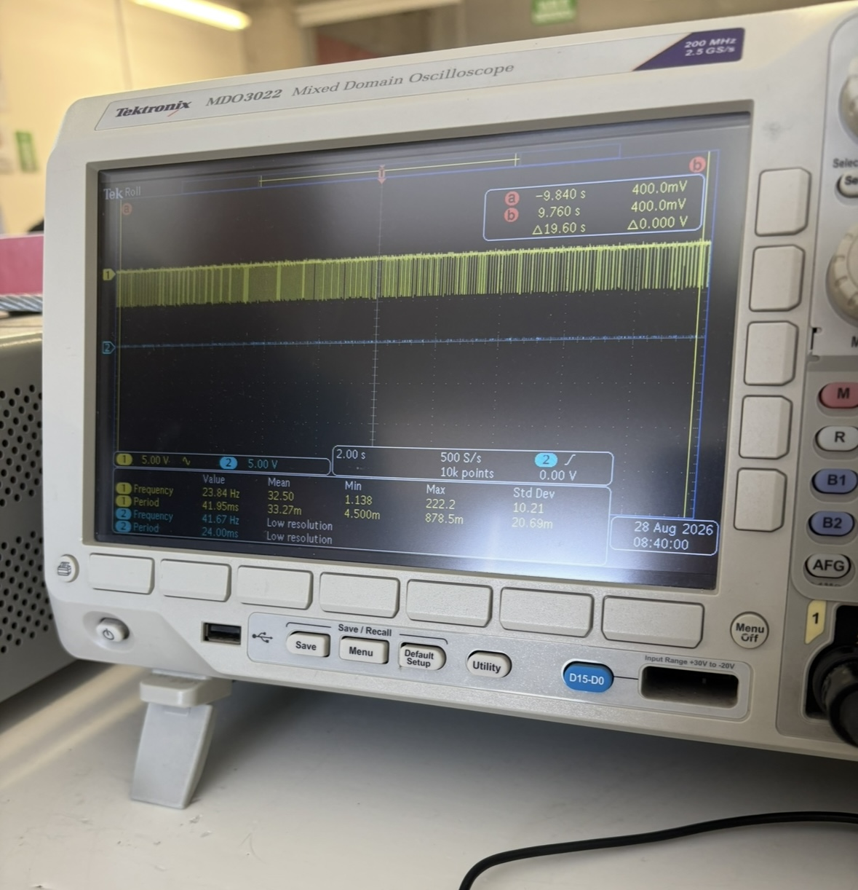

# Sesión 2 - Como hice mi primer circuito

## Qué debía lograr hoy

- ⁠[✅] Comprender los conceptos base de electricidad y electrónica (V, I, R, P, AC/DC)
- [❌] Conocer componentes y equipos de medición
- [✅]Evitar errores típicos de montaje 
- [✅]Construir un primer circuito funcional con el temporizador 555, midiendo y comparando los resultados con la teoría.

## Qué usé

- Protoboard
- Jumpers
- Resistores (1KΩ/15KΩ/220Ω)
- LEDs (diodos emisores de luz)
- Capacitor Bipolar (33μF/10μF)
- Capacitor ceramico 10μF
- Temporizador 555
- Multimetro digital
- osciloscopio
- pinzas caiman

## Qué hice y qué pasó (evidencia)
Realizamos un circuito de encendido de led utilisando un temporizador 555 para posteriormente utilizar diferentes tipos de capasitores y analizar sus diferencias

Primero creamos un circuito con led en el cual utilizamos un capasitor bipolar generando que este parpadeara de forma constante

de igual manera usamos el mismo circuito pero en lugar de utilizar el capasitor bipolar utilizamos un capasitor ceramico el cual provoco que, a simple vista, el led se quedara ensendido

Despues utilizanos un Osciloscopio el cual nos permitio ver una grafica de las hondas electricas que se estaban generando al momento de utilizar estos circuitos

| Magnitud | Capacitor electrónico | Capacitor cerámico |
| --- | --- | --- |
| Frecuencia | 27.78 Hz |39.33 Hz  |
|periodo|36 ms|39 ms|
|voltaje pico a pico|5 V|5 V|

En el circuito en el cual utilisamos el capasitor bipolar podemos notar que se crean elevaciones momentanias y constantes en la electricidad

Y al momento de utilizar el capasitor ceramico podemos notar que en realidad lo que estaba sucediendo es que el led se estaba constantemente prendiendo y apagando, a una velocidad tan rapida que el ojo humano no lo puede persivir

## Qué falló y cómo lo resolví

- ⁠*Síntoma:* Al conectar el led al circuito este no parpadeaba ni prendia, pero al momento de hacer contacto con uno de los jumpers, se prendia el LED, funcionando como boton
-  ⁠*Cómo lo encontré:* Mi compañero y yo estabamos buscando la razon de la falla y al tocar los jumpers notamos que prendia, entonces uno por uno buscamos cual fue la razon del prendido y encontramos el jumper que causo la reación
-  ⁠*Solución:* Concideramos que era más sencillo desconectar todo y revisar que cada componente funcionara de manera correcta

## Qué aprendí
Aprendí que incluso con componentes como los capacitores, se tiene que ser muy específico con el tipo de material del cual están hechos y con la cantidad de frecuencia que soportan para poder conseguir el resultado deseado. También me sorprendió el funcionamiento de las lámparas LED, ya que estas iluminan parpadeando a una velocidad muy grande en vez de solo mantenerse prendidas, y es por eso que, al momento de que empiezan a fallar, se puede ver un leve parpadeo.

## Siguiente paso
Practicar con más tipos de capasitores y aprender a ajustafr las graficas el osciloscopio

